# <center>Shopping</center>
[TOC]

​                                                                                                                            姓名： 陈慧毅

​                                                                                                                            学号：201870199
## 1.数据结构设计
数据结构部分主要用到两个结构体，商品commodity和各部分数据的标题title
### 1.1 commodity
```
struct commodity
{
	string ID, name, brand;
	double price;
	int real_num;
	string user_name;
	int expect_num;//预计剩下的数量，即该商品当前的库存减去所有用户放进购物车中的数                    //量
};
```
### 1.2 title
结构体定义如下：
```
struct title
{
	string ID, name, brand, price, real_num, ext;
};
```
## 2.功能分解
### 2.1 初始界面
初始界面提供用户注册、用户登录、管理员登陆和退出这几个选项。
### 2.2 用户注册
用户注册功能在用户设计好用户名并确认用户密码后，将相关信息存到用户.txt文件，同时为该用户创建2个.txt文件，分别用于记录该用户的购物车和足迹。
### 2.3 用户及管理员登陆
用户或者管理员在输入名字和密码后，与事先保存的密码进行对比，一致则调用user或admin函数，不一致则打印密码错误的提示并让用户或者管理重新输入。
### 2.4 用户
用户登陆成功后调用user函数进入用户界面，将该用户的几个文件信息读入，用户可以进行查看商品、搜索商品、将商品添加至购物车等功能。
+ 用户注销
将更改后的信息写入文件，将用户的操作保存到足迹文件中并退回到初始界面
+ 查看商品
将库存中的商品信息打印出来供用户查看
+ 搜索商品
根据用户输入的相关信息搜索库存，找到相关商品则打印出来，否则则提示没有相关商品
+ 查看购物车
将相应用户购物车文件中的信息打印出来供用户查看
+ 将商品添加至购物车
根据用户输入的ID和数量更改相应用户购物车中的信息，同时更改库存中的expect_num。
+ 将商品从购物车中删除
根据用户输入的ID和数量更改用户购物车和库存expect_num，此外当输入的数量比购物车中的数量大时要打印出相关提示
+ 结账
用户确认结账后，更改库存并清空用户购物车信息，同时更新售出清单中的内容
### 2.5 管理员
管理员登陆后调用admin函数进入管理员界面，将相关文件读入，管理员可以进行查看售出清单、增加删除商品、商品信息查询等功能
+ 管理员注销
将更改后的信息写入相关文件并退回初始界面
+ 商品信息查询
打印库存文件的相关信息供管理员查看
+ 添加、删除商品
根据管理员输入的ID和数量更改库存的信息
+ 修改商品数量
根据管理员输入的ID和数量修改库存中的商品数量
+ 售出清单查看
打印售出清单的相关信息供管理员查看
## 3.模块设计
主要分为5个模块
+ 初始界面main
+ 用户注册use_sign
+ 用户界面use
+ 管理员界面admin
+ 负责初始化各个界面和打印的print
## 4.核心函数声明
```
bool user_sign();//用户注册

void admin();//管理员界面

void admin_login();//管理员登录

void admin_insert(vector<commodity>& dst);//管理员添加商品

void admin_repcheck(vector<commodity>& dst, title tle);//管理员查询商品

void admin_delete(vector<commodity>& dst);//管理员删除商品

void admin_change(vector<commodity>& dst);//管理员修改商品数量

void admin_sldcheck(vector<commodity>& dst, title tle);//管理员查询售货清单

void getpassword(string& password);//输入密码

void intial();//主界面初始化

void admin_intial();//管理员界面初始化

void user_intial();//用户界面初始化

void user();//用户

bool user_ligin(map<string,string>& src,string& user);//用户登陆

void user_check(vector<commodity>& dst, title tle);//用户查看商品

void user_search(vector<commodity> dst,vector<string>& track,title tle);//用户搜索商品

void user_add(vector<commodity>& shop, vector<commodity>& rep, title tle, vector<string>& track);//用户向购物车中增加商品

void shopbus_check(vector<commodity>& shop, vector<commodity> rep, title tle);//用户查询购物车中的商品

void user_delete(vector<commodity>& shop, vector<commodity> rep, title tle, vector<string>& track);//用户删除购物车中的商品

void user_pay(vector<commodity>& shop, vector<commodity> rep, title tle);//用户结账

void tracks_check();//用户查询历史记录
```
## 5.操作说明及成果展示
### 5.1 用户注册
#### 5.11在初始界面选择2进入用户注册界面

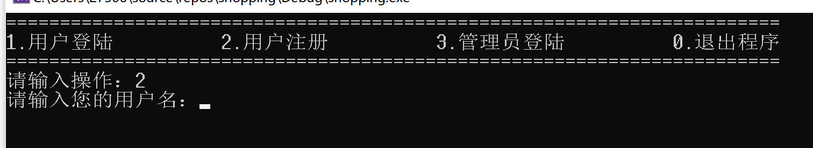

#### 5.11输入用户名，如果用户名已经存在则需重新输入

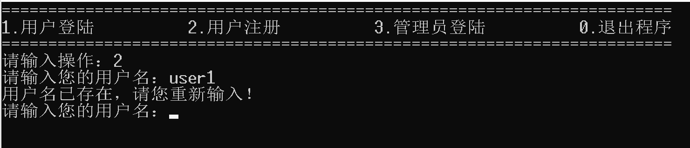

#### 5.12输入用户名后，输入密码并确认密码完成注册

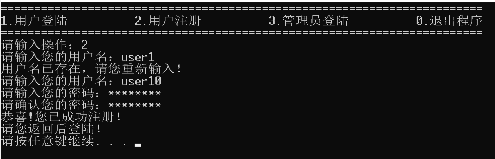

#### 5.13用户注册后会将注册信息保存至用户.txt文件，同时创建该用户的购物车文件和足迹文件

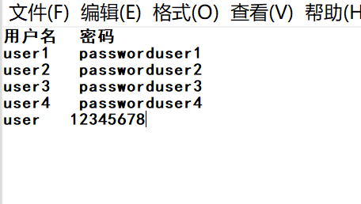

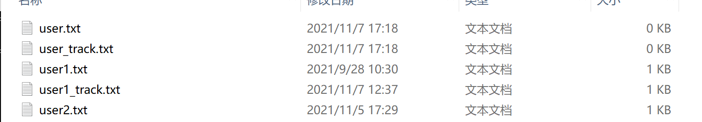

### 5.2管理员

#### 5.21初始界面选择3进入管理登陆界面，输入正确的ID和密码进入管理员界面（错误的ID和密码会要求重输）

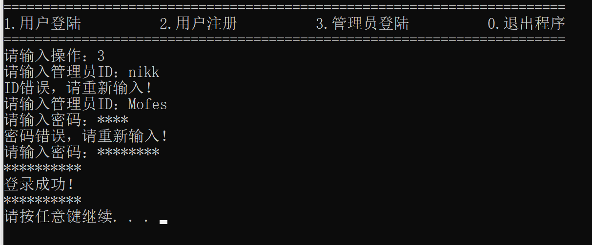

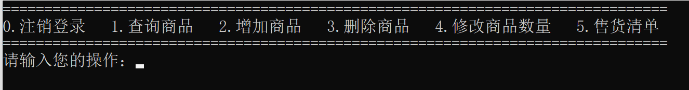

#### 5.22输入1可以查询当前的库存商品

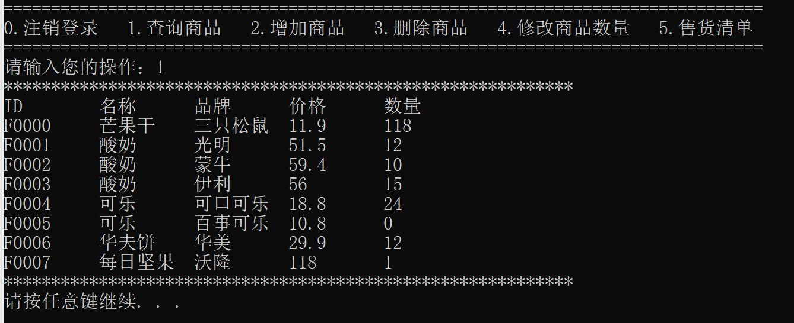

#### 5.23输入2可以增加商品（已经存在的会增加数量，不存在会新增商品，增加的同时也会修改expect_num

  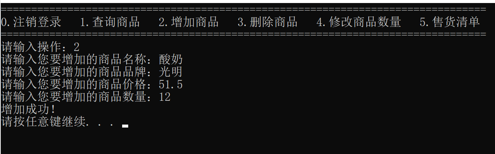

  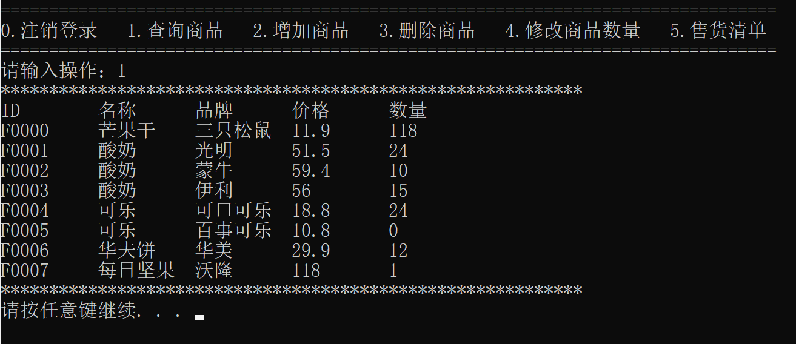


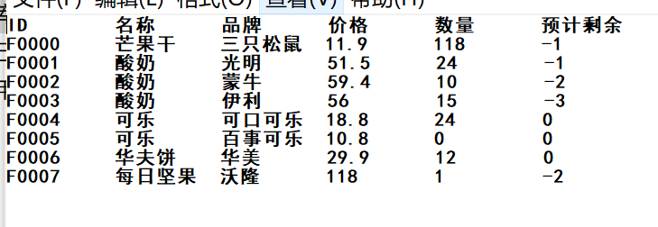

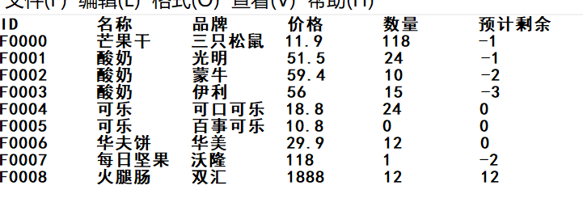

#### 5.24输入3可以删除商品

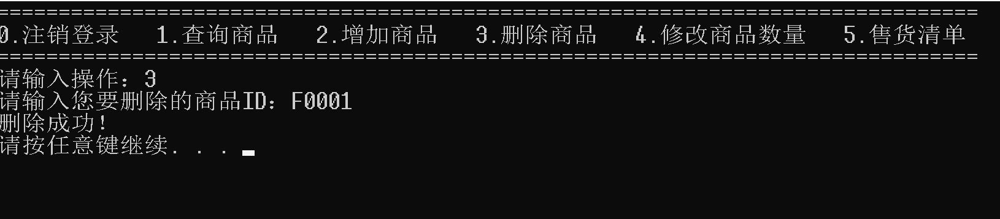

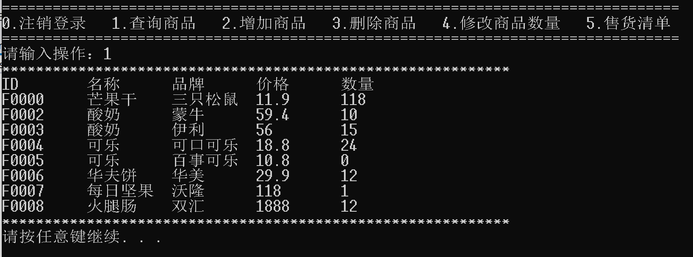

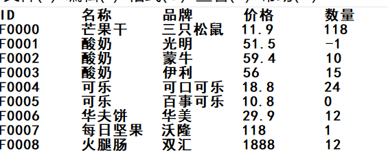

#### 5.25输入4可以修改商品数量

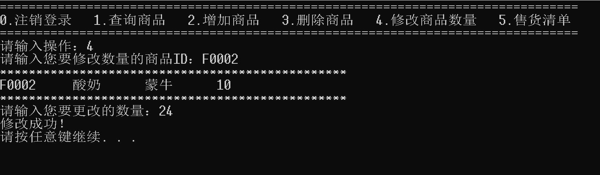

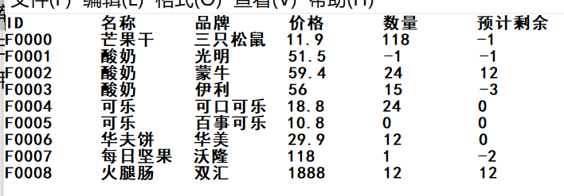

#### 5.26输入5可以查看售货清单

  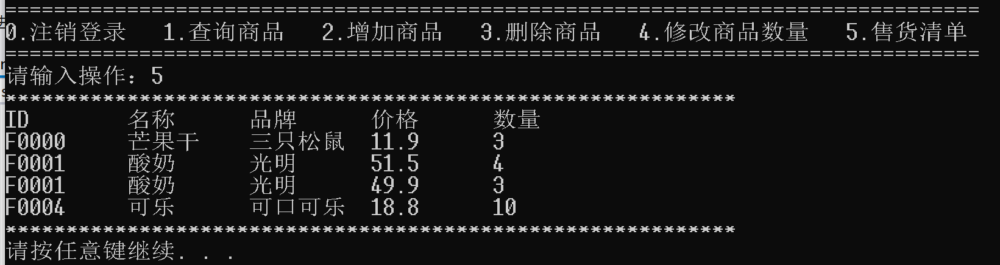
### 5.3用户

#### 5.31输入正确的ID和密码进行登陆

  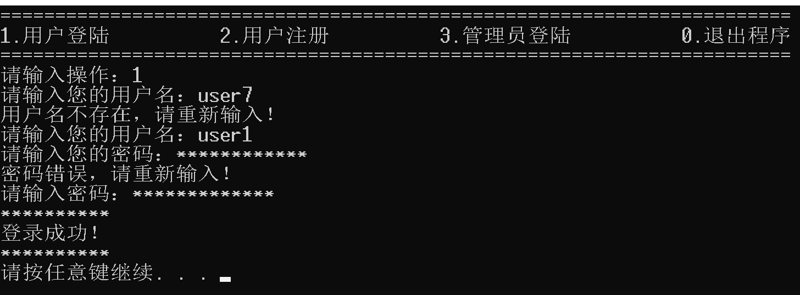

#### 5.32登陆后进入用户界面

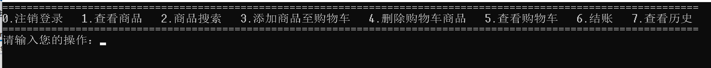

#### 5.33输入1可以查看商品

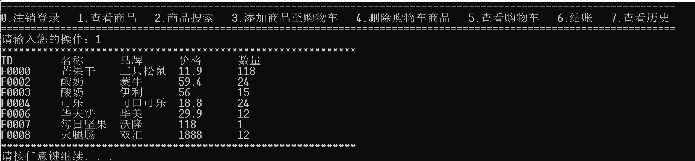

#### 5.34输入2可以进行商品搜索

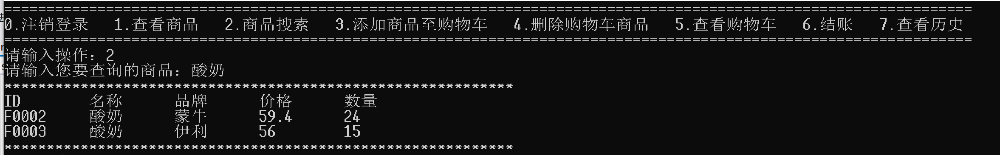

#### 5.35输入3可以添加商品至购物车

  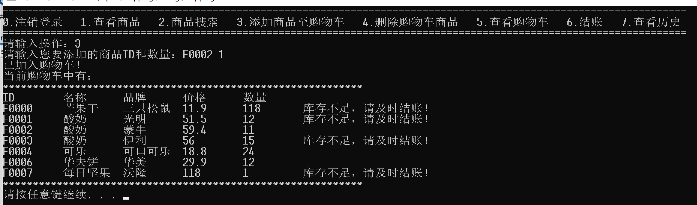

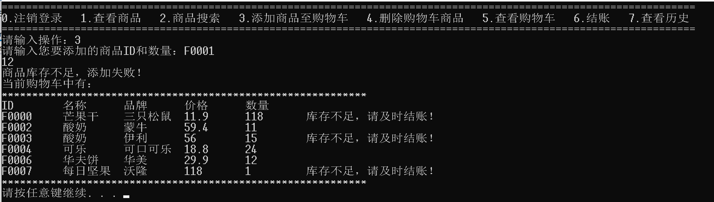

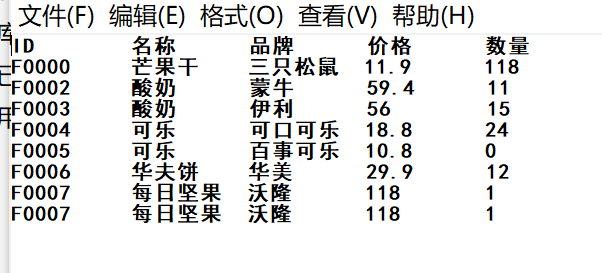


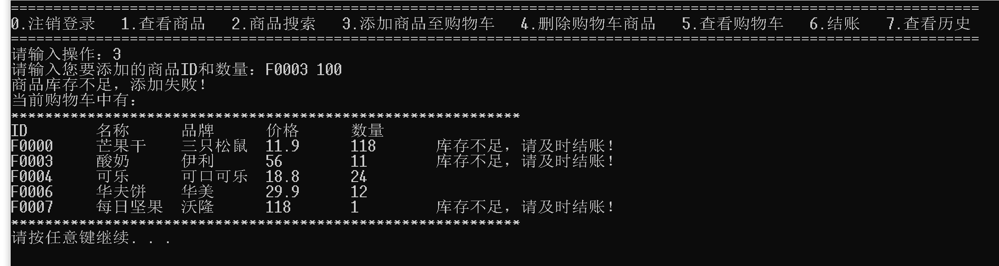


#### 5.36输入4可以删除购物车商品

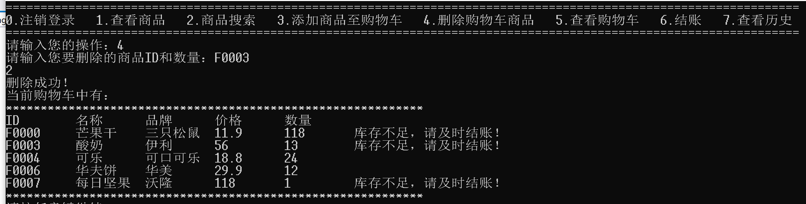

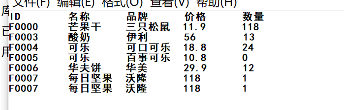

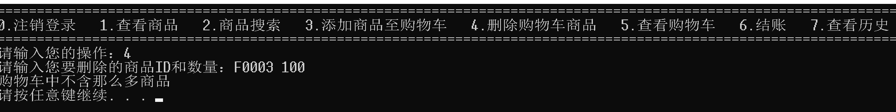

#### 5.37输入5可以查看购物车

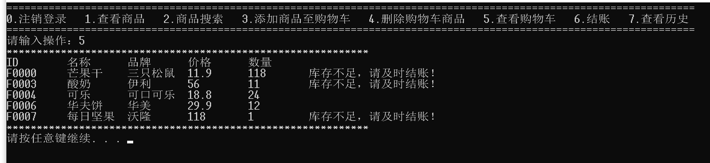

#### 5.38输入6可以进行结账

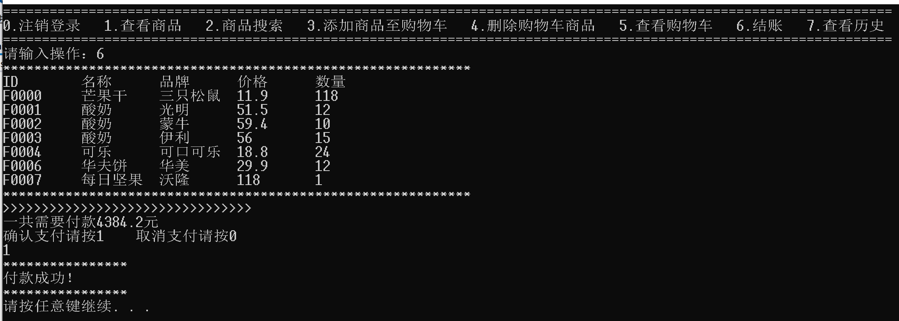

结账后会清空购物车，同时改变售货清单

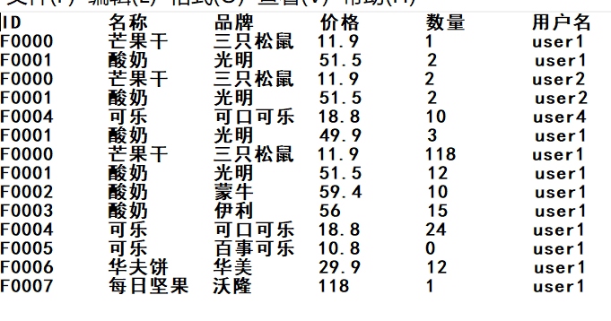


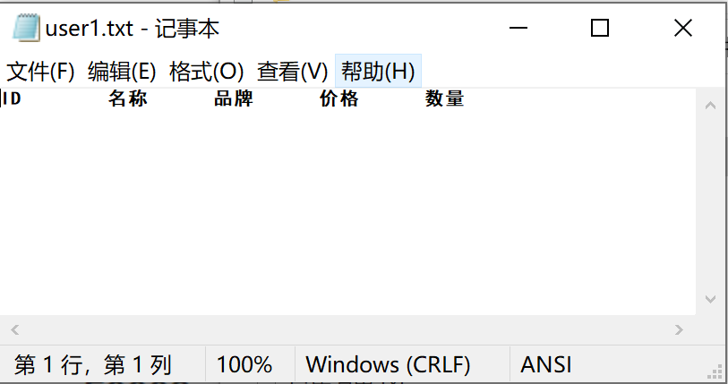

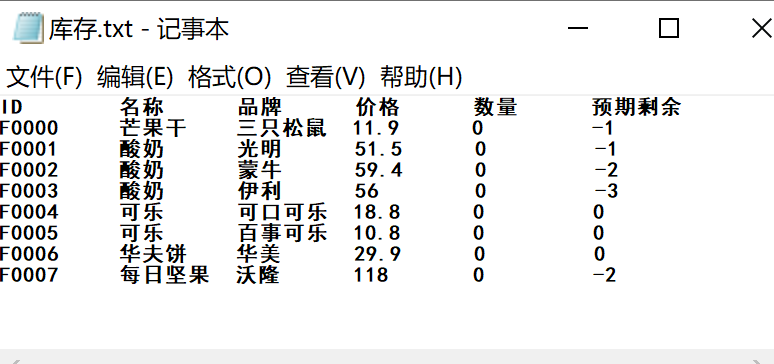


### 5.4拓展功能

#### 5.41输入的密码显示为*，且可自由删除


#### 5.42搜索商品时可以组合搜索

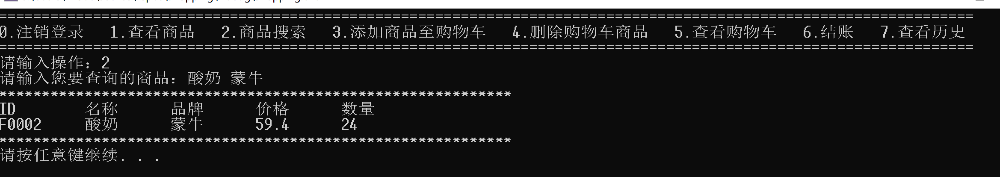

#### 5.43用户同时购买，管理员和用户同时操作，通过expect_num考虑商品库存问题，提示用户及时购买

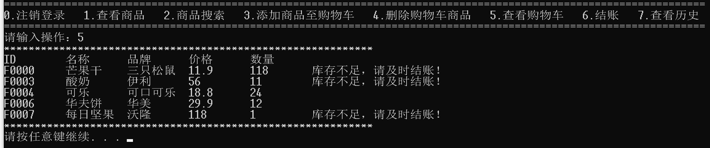

#### 5.44用户的操作会保存在足迹中，用户可以通过查看历史查看

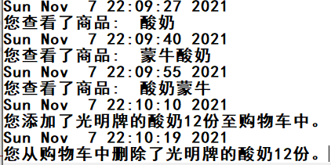

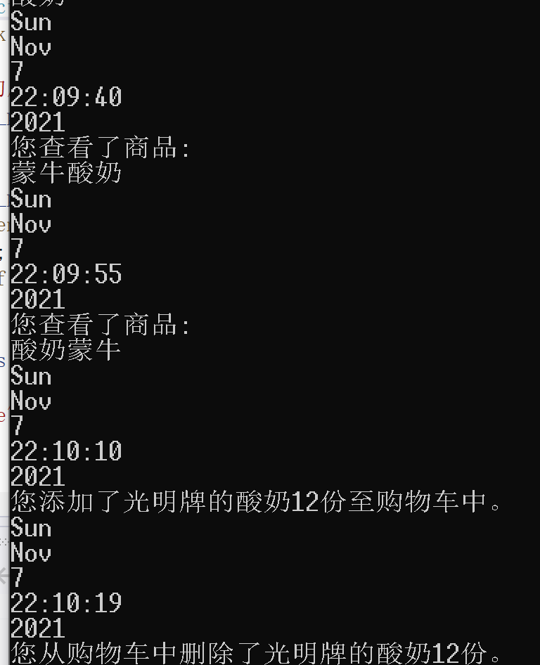
