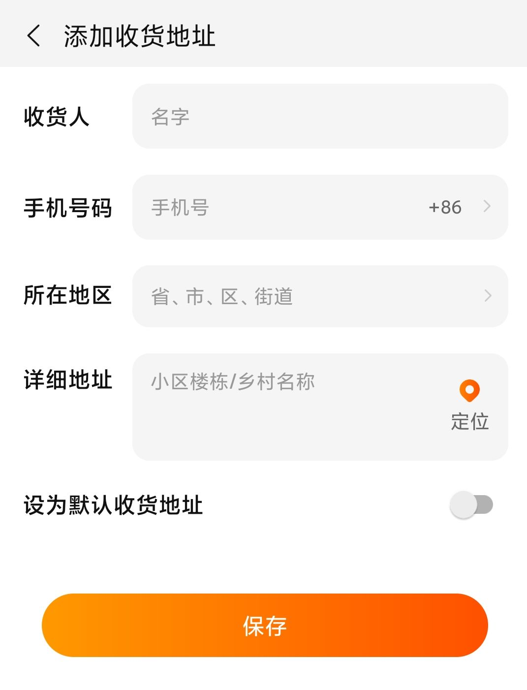

# <center>网店购物管理系统</center>
[TOC]

​                                                                                                                            姓名： 陈慧毅

​                                                                                                                            学号：201870199
## 1.数据结构设计
数据结构部分主要用到两个结构体，商品commodity和收货地址shipping_address
### 1.1 commodity
```
struct commodity
{
    char ID[6];
    char name[20];
    char brand[20];
    double price;
    int real_num;
    int expect_num;//预计剩下的数量，即该商品当前的库存减去所有用户放进购物车中的数                    //量
};
```
### 1.2 shipping_address
拓展功能的收货地址参考某宝



结构体定义如下：
```
struct shipping_address
{
    char name[20];
    char phone_number[20];
    char region[100];
    char detial_area[100];
};
```
## 2.功能分解
### 2.1 初始界面
初始界面打印欢迎信息并提供用户注册、用户登录、管理员登陆和退出这几个选项。
### 2.2 用户注册
用户注册功能在用户设计好用户名并确认用户密码后，将相关信息存到用户.txt文件，同时为该用户创建3个.txt文件，分别用于记录该用户的购物车、收货地址和足迹。
### 2.3 用户及管理员登陆
用户或者管理员在输入名字和密码后，与事先保存的密码进行对比，一致则调用user或admin函数，不一致则打印密码错误的提示并让用户或者管理重新输入。
### 2.4 用户
用户登陆成功后调用user函数进入用户界面，将该用户的几个文件信息读入，用户可以进行查看商品、搜索商品、将商品添加至购物车等功能。
+ 用户注销
将更改后的信息写入文件，将用户的操作保存到足迹文件中并退回到初始界面
+ 查看商品
将库存中的商品信息打印出来供用户查看
+ 搜索商品
根据用户输入的相关信息搜索库存，找到相关商品则打印出来，否则则提示没有相关商品
+ 查看购物车
将相应用户购物车文件中的信息打印出来供用户查看
+ 将商品添加至购物车
根据用户输入的ID和数量更改相应用户购物车中的信息，同时更改库存中的expect_num。
+ 将商品从购物车中删除
根据用户输入的ID和数量更改用户购物车和库存expect_num，此外当输入的数量比购物车中的数量大时要打印出相关提示
+ 结账
用户确认结账后，更改库存并清空用户购物车信息，同时更新售出清单中的内容
### 2.5 管理员
管理员登陆后调用admin函数进入管理员界面，将相关文件读入，管理员可以进行查看售出清单、增加删除商品、商品信息查询等功能
+ 管理员注销
将更改后的信息写入相关文件并退回初始界面
+ 商品信息查询
打印库存文件的相关信息供管理员查看
+ 添加、删除商品
根据管理员输入的ID和数量更改库存的信息
+ 修改商品数量
根据管理员输入的ID和数量修改库存中的商品数量
+ 售出清单查看
打印售出清单的相关信息供管理员查看
## 3.模块设计
主要分为4个模块
+ 初始界面main函数
+ 用户注册use_sign函数
+ 用户界面use_login函数和use函数
+ 管理员界面admin_login函数和admin函数
## 4.核心函数声明
```
bool use_login();//用户登陆

bool admin_login();//管理员登陆

void user();//进入用户界面

void check(vector<commodity> & dst);//打印商品库存信息、购物车信息、收货清单信息等

void search(string name,vector<commodity> & repertory);//搜索商品

bool shop_insert(char * ID,int num,vector<commodity> & shopbus,vector<commodity> & repertory);//将商品添加到购物车

bool shop_delete(char * ID,int num,vector<commodity> & shopbus,vector<commodity> & repertory)；//删除购物车商品

void pay(vector<commodity> & repertory,vector<commodity> & shopbus);//结账

void use_logout(vector<commodity> & shopbus,vector<commodity> & repertory);//用户注销

voidtrack(vector<commodity> & footprint);//记录用户的操作

void admin()//管理员界面

bool admin_delete(char * ID,int num,vector<commodity> & repertory)；//删除商品

bool admin_insert(char * ID,int num,vector<commodity> & repertory)；//增加商品

bool admin_嫦娥(char * ID,int num,vector<commodity> & repertory)；//修改商品数量

void admin_logout(vector<commodity> & repertory);//管理员注销
```