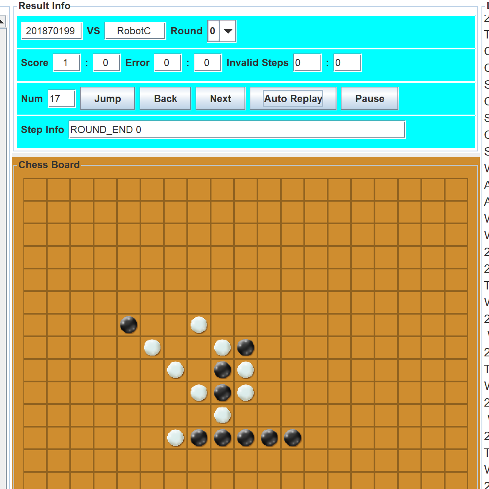
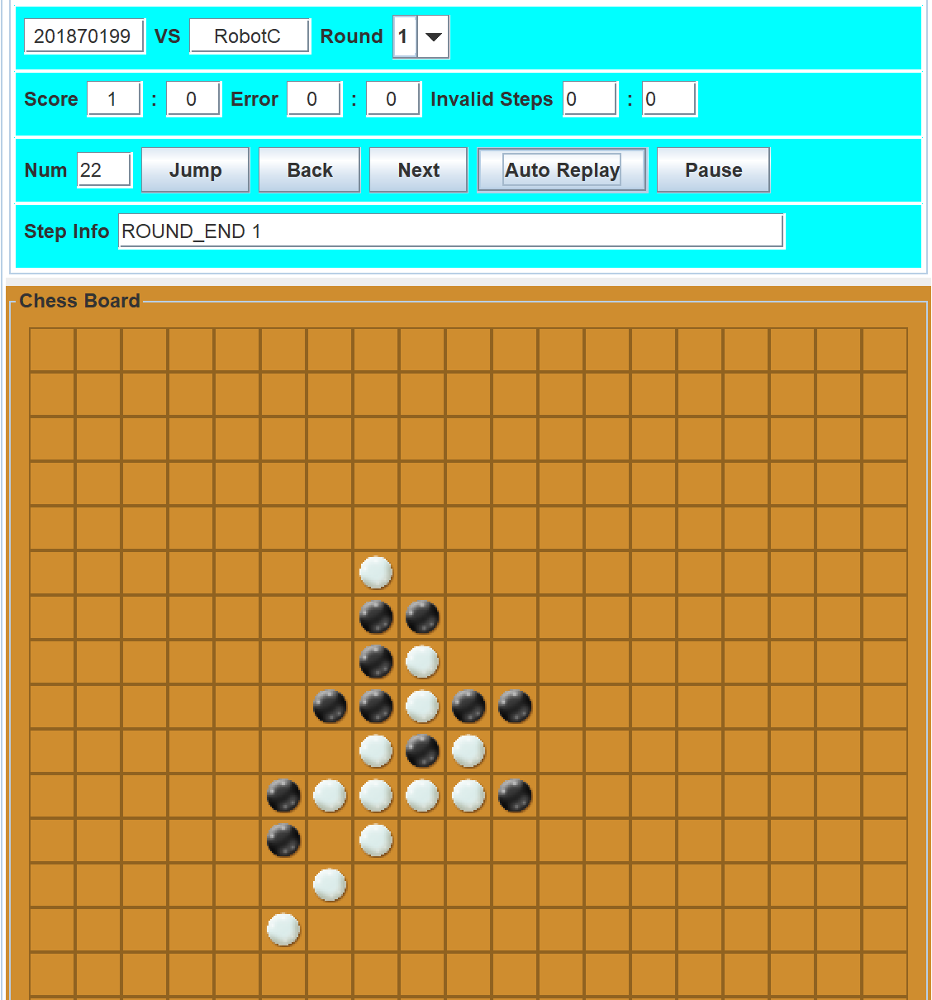
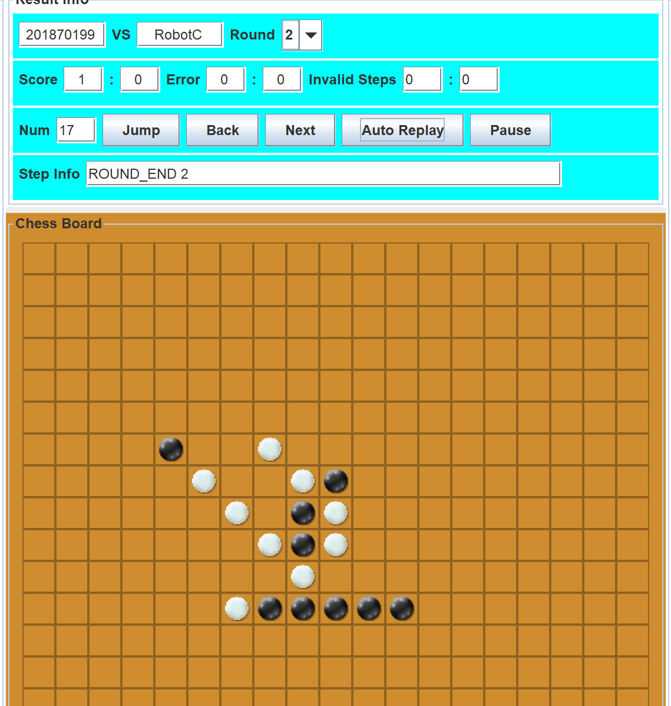
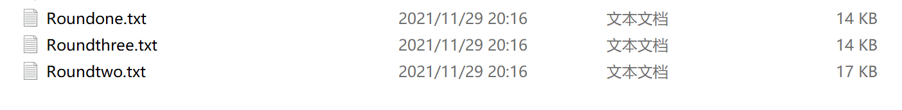
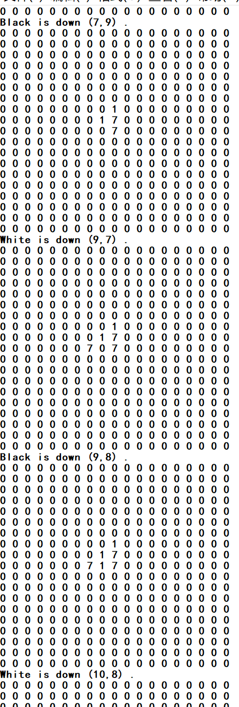

# <center>五子棋AI设计手册</center>
[TOC]

​                                                           


​                                                                                                                                        姓名：陈慧毅

​                                                                                                                                        学号：201870199


<div STYLE="page-break-after: always;"></div>
## 一、数据结构
该实验是在原有的框架上进行编程，并未使用过多的数据结构，仅用了一个二维数组来存本地棋盘和map来存不同棋型的分数
+ 二维数组
```
int board[19][19] = {};
```
+ map
```
 map<string, int> value = {
        //己方
        {"011111",1100000},//连五
        {"111110",1100000},
        {"711111",1100000},
        {"111117",1100000},
        {"111111",1100000},
        {"011110",110000},//活四
        {"011117",15000},//冲四
        {"010111",15000},
        {"101110",15000},
        {"011011",15000},
        {"110110",15000},
        {"001110",11000},//活三
        {"011100",11000},
        {"010110",11000},
        {"001117",1000},//眠三
        {"010117",1000},
        {"011017",1000},
        {"010011",1000},
        {"100110",1000},
        {"010101",1000},
        {"101010",1000},
        {"701110",1000},
        {"011107",1000},
        {"001100",200},//活二
        {"001010",200},
        {"010100",200},
        {"010010",200},
        {"000117",100},//眠二
        {"001017",100},
        {"010017",100},
        {"010001",100},
        {"100010",100},//一子
        {"170000",10},
        {"017000",10},
        {"001700",10},
        {"000170",10},
        {"000017",10},
        //对手
        {"077777",-1000000},//连五
        {"777770",-1000000},
        {"177777",-1000000},
        {"777771",-1000000},
        {"777777",-1000000},
        {"077770",-100000},//活四

        {"077771",-12000},//冲四
        {"070777",-12000},
        {"707770",-12000},
        {"077077",-12000},
        {"770770",-12000},

        {"007777",-12000},
        {"177770",-12000},
        {"170777",-12000},
        {"707771",-12000},
        {"770771",-12000},
        {"177077",-12000},
        {"007770",-10000},//活三
        {"077700",-10000},
        {"070770",-10000},
        {"007771",-1000},//眠三
        {"070771",-1000},
        {"077071",-1000},
        {"070077",-1000},
        {"700770",-1000},
        {"070707",-1000},
        {"707070",-1000},
        {"107770",-1000},
        {"077701",-1000},
        {"007700",-200},//活二
        {"007070",-200},
        {"070700",-200},
        {"070070",-200},
        {"000771",-100},//眠二
        {"007071",-100},
        {"070071",-100},
        {"070007",-100},
        {"700070",-100}
    };
```
## 二、核心算法
AI的核心算法就是贪心算法，计算每个可落子的位置的分值，然后选择分值最大的位置进行落子。其中细节实现上做如下处理：
+ 根据owncolor使得在维护本地棋盘是，1总是代表己方的子，7总是代表对方的子
+ 对有棋子区域的上下左右维护一个边界，扫描这个边界，周围有棋子的空位即为要计算的可落子点
+ 每个可落子点的分数是这样计算的：首先由这个点向上、下、左、右、左上、左下、右上、右下，8个方向各扫描4个单位，得到4个长度为9的字符串（如果出现越界，长度会小于9），对这4个字符串分别进行估值。其中6个字符为一个单位，该落子点己方下的分数减去该落子点对方下的分数即为该字符串的分数，四个字符串的分数之和即为该落子点的分数。
+ 每次选择分数最高的位置进行落子即可
~~试着写了剪枝，但似乎写的有问题，还不如没写前的聪明，于是作罢~~
~~AI不太聪明，似乎不怎么会走禁手，于是没有判定~~
## 三、部分函数声明及介绍
```
pair<int, int> step()//计算下一步落子的位置
int getvalue(int row, int col);//计算落子点的分数
int calculate(string& sp, string& sa);//计算某个方向的分数
void saveChessBoard(int row, int col, int color);//保存结果用于复盘
void handleMessage(int row, int col, int color);//将对手和自己走的位置保存到
                                                //本地棋盘
void boardintial();//初始化棋盘并创建保存复盘的文件

```
## 四、成果及复盘展示











## 五、代码附录
### 1.step()
```
pair<int, int> Reversi::step()
{
	int r, c, maxval = 0;
	for (int i = loc2w; i <= loc2s; ++i)
		for (int j = loc2a; j <= loc2d; ++j)
			if (board[i][j] == 0)
			{
				if (board[i - 1][j] || board[i][j - 1] || board[i + 1][j] || board[i][j + 1] || board[i - 1][j + 1] || board[i - 1][j - 1] || board[i + 1][j - 1] || board[i + 1][j + 1])
				{
					int temp = getvalue(i, j);
					if (temp > maxval)
					{
						maxval = temp;
						r = i;
						c = j;
					}
				}
			}
			else
				continue;
	return make_pair(r, c);
}
```
### 2. getvalue(int row, int col)
```
int Reversi::getvalue(int row, int col)
{
	int val = 0;
	string sp="",sa="";
	for (int i = 4; i!=0; i--)
	{
		int l = row - i;
		if (l < 0)
			continue;
		else
		{
			sp += (board[l][col] + '0');
			sa += (board[l][col] + '0');
		}
	}
	sp += '7';
	sa += '1';
	for (int i = 1; i < 5 ; ++i)
	{
		int r = row + i;
		if (r > 18)
			break;
		else
		{
			sp += (board[r][col] + '0');
			sa += (board[r][col] + '0');
		}
	}
	val += calculate(sp, sa);
	for (int i = 4; i !=0; i--)
	{
		int l = col - i;
		if (l < 0)
			continue;
		else
		{
			sp += (board[row][l] + '0');
			sa += (board[row][l] + '0');
		}
	}
	sp += '7';
	sa += '1';
	for (int i = 1; i < 5; ++i)
	{
		int r = col + i;
		if (r > 18)
			break;
		else
		{
			sp += (board[row][r] + '0');
			sa += (board[row][r] + '0');
		}
	}
	val += calculate(sp, sa);
	for (int i = 4; i !=0; i--)
	{
		int r = row + i;
		int c = col - i;
		if (c < 0||r>18)
			continue;
		else
		{
			sp += (board[r][c] + '0');
			sa += (board[r][c] + '0');
		}
	}
	sp += '7';
	sa += '1';
	for (int i = 1; i < 5; ++i)
	{
		int r = row - i;
		int c = col + i;
		if (r <0||c>18)
			break;
		else
		{
			sp += (board[r][c] + '0');
			sa += (board[r][c] + '0');
		}
	}
	val += calculate(sp, sa);
	for (int i = 4; i != 0; i--)
	{
		int r = row - i;
		int c = col - i;
		if (c < 0 || r<0)
			continue;
		else
		{
			sp += (board[r][c] + '0');
			sa += (board[r][c] + '0');
		}
	}
	sp += '7';
	sa += '1';
	for (int i = 1; i < 5; ++i)
	{
		int r = row + i;
		int c = col + i;
		if (r >18 || c>18)
			break;
		else
		{
			sp += (board[r][c] + '0');
			sa += (board[r][c] + '0');
		}
	}
	val += calculate(sp, sa);
	return val;
}
```
### 3.calculate(string& sp, string& sa)
```
int Reversi::calculate(string& sp, string& sa)
{
	if (sp.size() < 6)
		return -1;
	int pre = 0, aft = 0, end = sp.size() - 6;
	for (int i = 0; i <= end; ++i)
	{
		string s = "";
		for (int j = i; j < i + 6; ++j)
			s += sp[j];
		if (value.count(s))
			pre=(abs(pre)>abs(value[s]))?pre:value[s];
	}
	for (int i = 0; i <= end; ++i)
	{
		string s = "";
		for (int j = i; j < i + 6; ++j)
			s += sa[j];
		if (value.count(s))
			aft = (abs(aft) > abs(value[s])) ? aft : value[s];
	}
	sp = "";
	sa = "";
	return aft - pre;
}
```
### 4.saveChessBoard(int row, int col, int color)
```
void Reversi::saveChessBoard(int row, int col, int color)
{
	fstream file;
	file.open(path, ios::app);
	if (!file.is_open())
		exit(-1);
	string name = color ? "White is down " : "Black is down ";
	file << name << '(' << row << ',' << col << ") ." << endl;
	for (int i = 0; i < 19; ++i)
	{
		for (int j = 0; j < 19; ++j)
			file << board[i][j] << ' ';
		file << endl;
	}
}
```
### 5.handleMessage(int row, int col, int color)
```
void Reversi::handleMessage(int row, int col, int color) 
{
	board[row][col] = (color==ownColor)?1:7;
	loc2a = loc2a < col - 1 ? loc2a : col - 1;
	loc2d = loc2d > col + 1 ? loc2d : col + 1;
	loc2w = loc2d < row - 1 ? loc2w : row - 1;
	loc2s = loc2s > row + 1 ? loc2s : row + 1;
	loc2a = loc2a < 0 ? 0 : loc2a;
	loc2d = loc2d %19;
	loc2w = loc2d <0 ? 0 : loc2w;
	loc2s = loc2s % 19;
	saveChessBoard(row, col, color);
}
```
### 6.boardintial()
```
void Reversi::boardintial()
{
	for (int i = 0; i < 19; ++i)
		for (int j = 0; j < 19; ++j)
			if (i == 9 && j == 9)
				board[i][j] = ownColor ? 1 : 7;
			else
				board[i][j] = 0;
	loc2a = 8;
	loc2d = 10;
	loc2s = 10;
	loc2w = 8;
	path = "C:\\Users\\27506\\Desktop\\clinet_win\\";
	string name;
	if (myround == 0)
		name= "Roundone.txt";
	else if (myround == 1)
		name= "Roundtwo.txt";
	else
		name= "Roundthree.txt";
	path += name;
	fstream file;
	file.open(path, ios::out);
	if (!file.is_open())
		exit(-1);
	file.close();
}
```