# <center>用户手册</center>
[TOC]

​                                                           


​                                                                                                                                             姓名：陈慧毅

​                                                                                                                                             学号：201870199


<div STYLE="page-break-after: always;"></div>
## 一、项目主要思路流程图

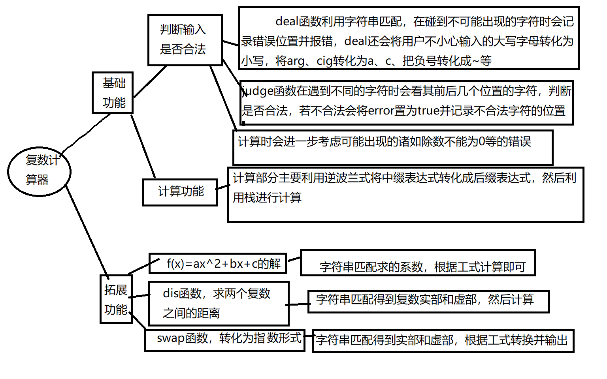

## 二、功能实现
### 1.基础功能
#### 1.1输入是否合法判断
##### 1.11 deal函数
文字解释部分位于代码注释
```
string deal(string initial, bool &error)
{
    int *arr = new int[initial.length()]{};//用来记录错误字符的位置
    for (int i = 0; i < initial.length(); ++i)
        if (initial[i] >= 'A' && initial[i] <= 'Z')
            initial[i] = initial[i] - ('A' - 'a');
    string temp = "";
    for (int i = 0; i < initial.length(); ++i)
    {
        if ((i == 0 && initial[i] == '-') || (initial[i] == '-' && initial[i - 1] == '('))
            temp += '~';//判断‘-’是负号的情况并把它转化成‘~’
        else if (initial[i] == 'a' && initial[i + 1] == 'r' && initial[i + 2] == 'g')
        {
            temp += 'a';
            i += 2;
        }
        else if (initial[i] == 'c' && initial[i + 1] == 'j' && initial[i + 2] == 'g')
        {
            temp += 'c';
            i += 2;
        }
        else if (initial[i] == 'i' || initial[i] == '+' || initial[i] == '-' || initial[i] == '*' || initial[i] == '/' || initial[i] == '|' || initial[i] == '(' || initial[i] == ')' || initial[i] == '^' || initial[i] == '.' || isdigit(initial[i]))
            temp += initial[i];
        else
        {
            error = true;
            arr[i] = 1;
        }
    }
    .....
}
```
##### 1.12 judge函数
```
bool judge(string initial)
{
    bool error = false;
    string errortype;//记录错误的类型
    vector<int> left;//用于后面的括号匹配
    int *arr = new int[initial.length()]{};//记录错误字符的位置
    for (int i = 0; i < initial.length(); ++i)
    {
        if (i == 0)//对于开头的处理
        {
            if (initial[i] == ')' || initial[i] == '+' || initial[i] == '*' || initial[i] == '/' || initial[i] == '^')
            {
                error = true;
                errortype = "Expressions can't start with ";
                errortype += initial[i];
                arr[i] = 1;
                break;
            }
        }
        if (initial[i] == '+' || initial[i] == '*' || initial[i] == '^' || initial[i] == '/' || initial[i]=='-')//对于是操作符的处理
        {
            if (initial[i + 1] == '+' || initial[i + 1] == '^' || initial[i + 1] == '-' || initial[i + 1] == '*' || initial[i + 1] == '/' || initial[i + 1] == ')')
            {
                error = true;
                errortype = "Operators can't be followed by operators or ')'!";
                arr[i] = 1;
                arr[i + 1] = 1;
                break;
            }
        }
 .......
 }
```
对其他字符的处理与上方类似，代码详情见附录
##### 1.13 报错及高亮
```
 if (error)
    {
        for (int i = 0; i < initial.length(); ++i)
            if (arr[i])//如果是导致输入不合法的字符arr[i]的值为1，输出为红色
            {
                SetConsoleTextAttribute(GetStdHandle(STD_OUTPUT_HANDLE), FOREGROUND_INTENSITY | FOREGROUND_RED);//在window.h头文件中
                cout << initial[i];
            }
            else
            {
                SetConsoleTextAttribute(GetStdHandle(STD_OUTPUT_HANDLE), FOREGROUND_INTENSITY | FOREGROUND_RED | FOREGROUND_GREEN | FOREGROUND_BLUE);
                cout << initial[i];
            }
        cout << ",  ";
        SetConsoleTextAttribute(GetStdHandle(STD_OUTPUT_HANDLE), FOREGROUND_INTENSITY | FOREGROUND_RED);
        cout << "error: " << errortype << endl;
        SetConsoleTextAttribute(GetStdHandle(STD_OUTPUT_HANDLE), FOREGROUND_INTENSITY | FOREGROUND_RED | FOREGROUND_GREEN | FOREGROUND_BLUE);
    }
```
#### 1.2 计算
##### 1.21复数结构体的定义
```
struct complex
{
    double real = 0;
    double image = 0;
};
```
##### 1.22 操作符栈内、栈外优先级处理函数isp和icp
、、、
float isp(char c, bool flag)
{
    if (c == '|' && flag)//flag用来判断‘|’是左还是右，并给予不同的优先级
        return 1.5;
    else if (c == '~' || c == '|' || c == 'c' || c == 'a' || c == 'd' || c == '$')//'$'该符号是对于括号里面是实数外面是‘i’的情况，将‘i’变成‘$’
        return 9;
    else if (c == '^')
        return 7;
    else if (c == '*' || c == '/')
        return 5;
    else if (c == '+' || c == '-')
        return 3;
    else if (c == '(')
        return 1;
    else if (c == ')')
        return 10;
    return 0;
}
、、、
icp与isp类似，详细代码见附录
##### 1.23 calculator函数实现中缀转后缀并将栈和操作符传给calculate函数进行计算并输出
```
bool calculator(string initial)
{
    bool flag = false;
    stack<char> sign;
    stack<complex> operand;
     for (int i = 0; i < initial.length(); ++i)
    {
        if (initial[i] == ','||initial[i]==' ')
            continue;
        else if (initial[i] == 'i')
        {
            if (i)
                if (initial[i - 1] == ')')
                {
                    initial[i] = '$';//括号里面是实数外面直接跟i的处理
                    i--;
                    continue;
                }
            complex temp;
            temp.image = 1.0;
            operand.push(temp);
            continue;
        }
        ....
        ....                              //复数的实部和虚部时分开存储的，即                                               a+bi会分别被存为a+0i和0+bi
        else if (isdigit(initial[i]))    //碰到数字时，提取出数字后根据后面是
        {                               //否有i进行将其赋给complex的real或
            double p1 = 10.0, p2 = 0.1;//或者img
            double x = 0;
            complex temp;
            while (isdigit(initial[i]))
            {
                x = x * p1 + initial[i] - '0';
                i++;
            }
            if (initial[i] == '.')
            {
                i++;
                while (isdigit(initial[i]))
                {
                    x = x + p2 * (initial[i] - '0');
                    p2 = p2 * (0.1);
                    i++;
                }
            }
            if (initial[i] == 'i')
            {
                temp.image = x;
            }
            else
            {
                temp.real = x;
                i--;
            }
            operand.push(temp);
            continue;
        }
//calculator函数是在将中缀转化成后缀时，同时进行计算，没出栈一个操作符都会传给calculate函数进行计算

//对操作符的处理部分
 while ((!sign.empty()) && (icp(initial[i], flag) < isp(sign.top(), flag)))              //sign不空且栈外优先级低出栈
            {
                char op = sign.top();
                sign.pop();
                calculate(operand, op, flag);
            }
            if (sign.empty())    //栈空直接入栈
            {
                sign.push(initial[i]);
                if (initial[i] == '|') //flag是为了处理'||'的左右问题
                    flag = true;
            }
            else
            {
                if (icp(initial[i], flag) > isp(sign.top(), flag))
                {
                    sign.push(initial[i]);//栈外优先级高，直接入栈
                    if (initial[i] == '|')
                        flag = true;
                }
                else if (icp(initial[i], flag) == isp(sign.top(), flag))
                {
                    if (initial[i] == '|')  //优先级相同时，是取模符号进行取模
                    {                      //运算，是括号直接出栈
                        char op = sign.top();
                        sign.pop();
                        calculate(operand, op, flag);
                    }
                    else
                        sign.pop();
                }
            }
```
calculateor的具体输出细节见附录
##### 1.24 calculate函数
```
bool calculate(stack<complex> &operand, char op, bool &flag)
{
    switch (op)
    {
    case '+':
    {
        complex a = operand.top();
        operand.pop();
        complex b = operand.top();
        operand.pop();
        complex temp;
        temp.image = a.image + b.image;
        temp.real = a.real + b.real;
        operand.push(temp);
        return true;
    }
    ....
    ....
    //其他运算详情见附录
```
### 2 拓展功能
#### 2.1 求解一元二次方程的根
```
....

//利用字符串的匹配得到系数a、b、c，详情见附录
//对于输入不是一元二次方程的会报错
       double t = b * b - 4 * a * c;
        if (t == 0)
            cout << "Result: "
                 << "x1=x2=" << (b) / (-2 * a) << endl;
        else if (t > 0)
            cout << "Result: "
                 << "x1=" << (-b + sqrt(t)) / (2 * a)
                 << "    "
                 << "x2=" << (-b - sqrt(t)) / (2 * a)
                 << endl;
        else
        {
            double img = fabs(sqrt(-t) / (2 * a));
            cout << "Rrsult: "
                 << "x1=" << (-b) / (2 * a) << "+" << img << 'i' << "    "
                 << "x2=" << (-b) / (2 * a) << "-" << img << 'i' << endl;
        }//利用公式求根
```
#### 2.2 求两个复数之间的距离dis（）函数
```
//字符匹配得到复数实部和虚部的详情见附录
    double x = a[0] - a[1], y = b[0] - b[1];
    cout << "Result: " << sqrt(x * x + y * y) << endl;
```
#### 2.3 将输入的复数转化为指数形式的swap函数
```
//字符匹配得到复数实部和虚部的详情见附录
   double r = sqrt(a * a + b * b), ang = atan(b / a);
    cout << "Result: " << r << 'e' << '(' << ang << 'i' << ')'<<endl;
```
## 三、用户使用说明及成果展示
###  基础功能

支持出实数、纯虚数和虚实混合的复数运算，且能够对用户的输入是否合法进行判断，功能展示如下：
#### 判断输入是否合法部分
+ 大小写不影响

  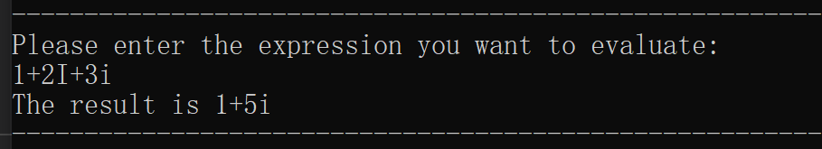
+ 开头、结尾不合法判断

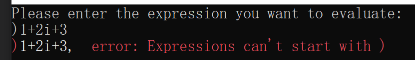

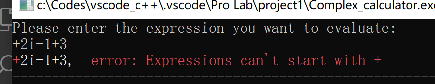

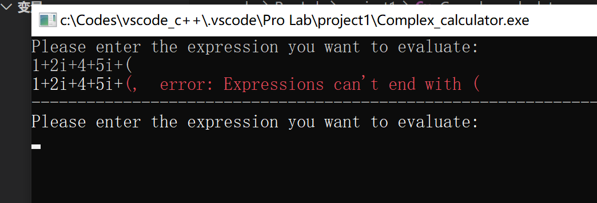

+ 操作符后面不能是右括号或者操作符

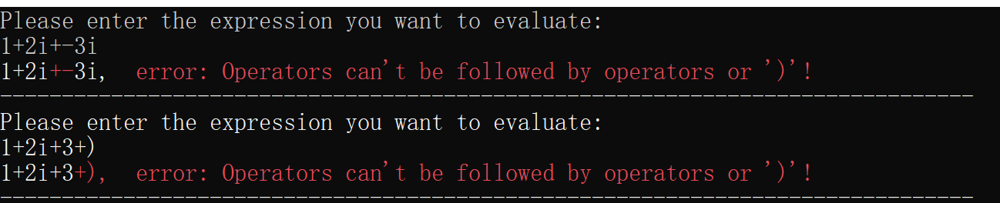
+ 实数后面不能是‘（’或者 ’|”

  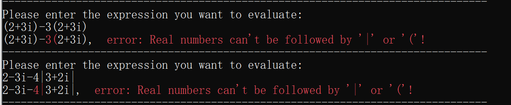
+ ‘i’前面的括号内必须是实数，后面不能是左括号、‘i'、实数和'|'

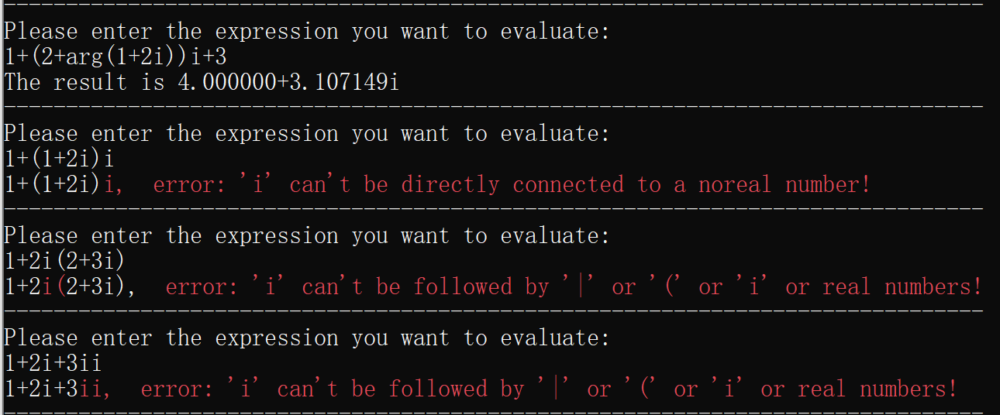

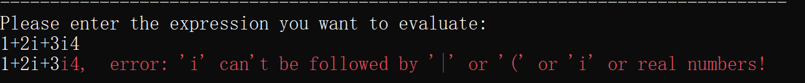

+ 左括号后面不能是右括号或者加减乘除

  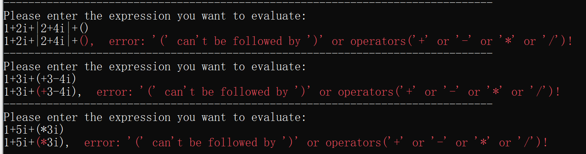

+ 右括号后面不能是左括号、取模或者操作数

  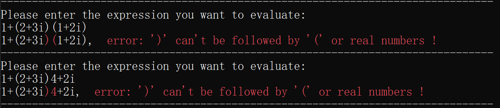
+ 括号匹配

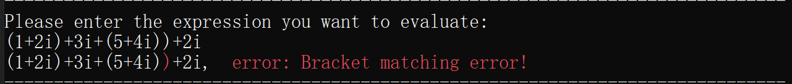

#### 计算部分
+ 纯实数计算
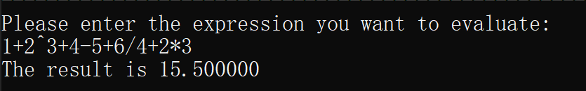

+ 虚实混合计算

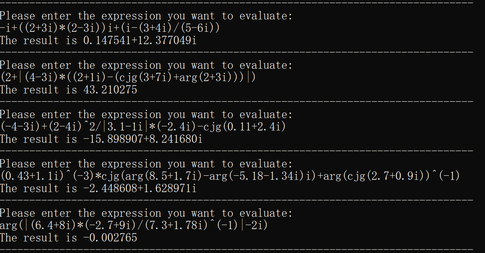
+ 特殊处理部分如除数不能为0，0不能求辐角主值

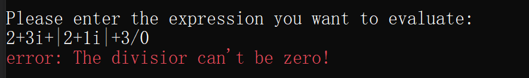

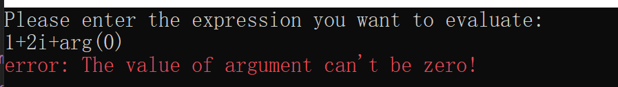

### 拓展功能
+ 求一元二次方程的解


+ 求两个复数之间的距离dis函数

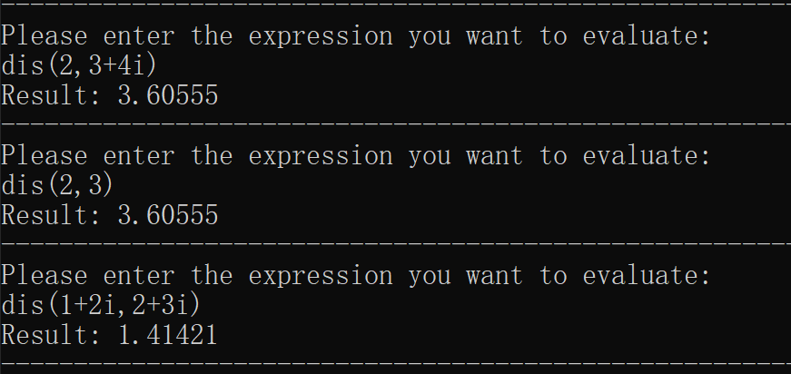
+ 将复数转化为指数形式

  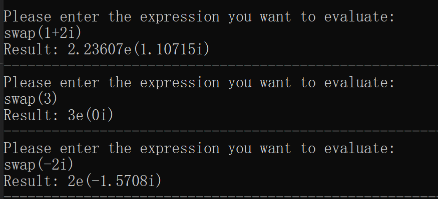


##  四、附录
###  头文件及函数声明
```
#include <iostream>
#include <windows.h>
#include <string>
#include <vector>
#include <ctype.h>
#include <stack>
#include <cmath>
#include <iomanip>
#include<stdlib.h>
#define pai acos(-1)
using namespace std;
struct complex
{
    double real = 0;
    double image = 0;
};
float icp(char c, bool flag);
float isp(char c, bool flag);
bool calculate(stack<complex> &operand, char op, bool &flag);
bool judge(string initial);
string deal(string initial, bool &error);
bool calculator(string initial);
void f(string initial);
void dis(string initial);
void swap(string initial);
```
###  main函数
```
int main()
{
    bool error = false;
    string Expression;
    cout << "Please enter the expression you want to evaluate:" << endl;
    getline(cin, Expression, '\n');
    while (Expression != "quit")
    {
        if (Expression[0] == 'f')
            f(Expression);
        else if (Expression[0] == 'd')
            dis(Expression);
        else if (Expression[0] == 's')
            swap(Expression);
        else
        {
            Expression = deal(Expression, error);
            if (!error)
                error = judge(Expression);
            if (!error)
                calculator(Expression);
        }
        cout << "-------------------------------------------------------------------------------" << endl;
        cout << "Please enter the expression you want to evaluate:" << endl;
        fflush(stdin);
        getline(cin, Expression, '\n');
    }
}
```
### 拓展部分求一元二次方程组的函数f
```
void f(string initial)
{
    bool error = false;
    int k = 0;
    double a = 0, b = 0, c = 0;
    for (int i = 0; i < initial.length(); ++i)
    {
        double x = 0, p1 = 10.0, p2 = 0.1;
        double sign = 1;
        if (initial[i] == '=')
        {
            i++;
            if (initial[i] == '-')
            {
                sign *= (-1);
                i++;
            }
            while (isdigit(initial[i]))
            {
                x = x * p1 + initial[i] - '0';
                i++;
            }
            if (initial[i] == '.')
            {
                i++;
                while (isdigit(initial[i]))
                {
                    x = x + p2 * (initial[i] - '0');
                    p2 = p2 * (0.1);
                    i++;
                }
            }
            if (initial[i] == 'x' && initial[i + 1] == '^')
                if (x == 0)
                    a = 1 * sign;
                else
                    a = sign * x;
            else
                error = true;
            k = i;
            break;
        }
    }
    for (int i = k; i < initial.length(); ++i)
    {
        double x = 0, p1 = 10.0, p2 = 0.1;
        double sign = 1;
        if (initial[i] == '2' && initial[i - 1] == '^')
        {
            i++;
            if (i == initial.length())
                break;
            if (initial[i] == '-')
                sign *= (-1);
            i++;
            while (i < initial.length() && isdigit(initial[i]))
            {
                x = x * p1 + initial[i] - '0';
                i++;
            }
            if (initial[i] == '.' && i < initial.length())
            {
                i++;
                while (isdigit(initial[i]))
                {
                    x = x + p2 * (initial[i] - '0');
                    p2 = p2 * (0.1);
                    i++;
                }
            }
            if (i == initial.length())
                c = x;
            if (initial[i] == 'x')
            {
                b = x;
                i++;
                double x = 0, p1 = 10.0, p2 = 0.1;
                double sign = 1;
                if (i == initial.length() - 1)
                    break;
                if (initial[i] == '-')
                    sign *= (-1);
                i++;
                while (i < initial.length() && isdigit(initial[i]))
                {
                    x = x * p1 + initial[i] - '0';
                    i++;
                }
                if (initial[i] == '.' && i < initial.length())
                {
                    i++;
                    while (isdigit(initial[i]))
                    {
                        x = x + p2 * (initial[i] - '0');
                        p2 = p2 * (0.1);
                        i++;
                    }
                }
                c = x;
            }
        }
    }
    if (error)
    {
        SetConsoleTextAttribute(GetStdHandle(STD_OUTPUT_HANDLE), FOREGROUND_INTENSITY | FOREGROUND_RED);
        cout << "error: "
             << "Invaild input!" << endl;
        SetConsoleTextAttribute(GetStdHandle(STD_OUTPUT_HANDLE), FOREGROUND_INTENSITY | FOREGROUND_RED | FOREGROUND_GREEN | FOREGROUND_BLUE);
    }
    else
    {
        double t = b * b - 4 * a * c;
        if (t == 0)
            cout << "Result: "
                 << "x1=x2=" << (b) / (-2 * a) << endl;
        else if (t > 0)
            cout << "Result: "
                 << "x1=" << (-b + sqrt(t)) / (2 * a)
                 << "    "
                 << "x2=" << (-b - sqrt(t)) / (2 * a)
                 << endl;
        else
        {
            double img = fabs(sqrt(-t) / (2 * a));
            cout << "Rrsult: "
                 << "x1=" << (-b) / (2 * a) << "+" << img << 'i' << "    "
                 << "x2=" << (-b) / (2 * a) << "-" << img << 'i' << endl;
        }
    }
}
```
### 拓展部分求距离函数dis()
```
void dis(string initial)
{
    double a[2], b[2];
    int j = 0;
    for (int i = 0; i < initial.length(); ++i)
        if (initial[i] == '(' || initial[i] == ',')
        {
            i++;
            double p1 = 10.0, p2 = 0.1;
            double x = 0, sign = 1;
            if (initial[i] == '-')
            {
                sign *= (-1);
                i++;
            }
            while (isdigit(initial[i]))
            {
                x = x * p1 + initial[i] - '0';
                i++;
            }
            if (initial[i] == '.')
            {
                i++;
                while (isdigit(initial[i]))
                {
                    x = x + p2 * (initial[i] - '0');
                    p2 = p2 * (0.1);
                    i++;
                }
            }
            if (initial[i] == 'i')
            {
                a[j] = 0;
                b[j++] = (x == 0) ? 1 * sign : x * sign;
            }
            else
            {
                a[j] = x * sign;
                double p1 = 10.0, p2 = 0.1;
                double x = 0, sign = 1;
                if (initial[i] == '-')
                    sign *= (-1);
                i++;
                while (isdigit(initial[i]))
                {
                    x = x * p1 + initial[i] - '0';
                    i++;
                }
                if (initial[i] == '.')
                {
                    i++;
                    while (isdigit(initial[i]))
                    {
                        x = x + p2 * (initial[i] - '0');
                        p2 = p2 * (0.1);
                        i++;
                    }
                }
                b[j++] = x *= sign;
            }
        }
    double x = a[0] - a[1], y = b[0] - b[1];
    cout << "Result: " << sqrt(x * x + y * y) << endl;
}
void swap(string initial)
{
    double a, b;
    for (int i = 0; i < initial.length();++i)
    {
        if(initial[i]=='(')
        {
            i++;
            double p1 = 10.0, p2 = 0.1;
            double x = 0, sign = 1;
            if (initial[i] == '-')
            {
                sign *= (-1);
                i++;
            }
            while (isdigit(initial[i]))
            {
                x = x * p1 + initial[i] - '0';
                i++;
            }
            if (initial[i] == '.')
            {
                i++;
                while (isdigit(initial[i]))
                {
                    x = x + p2 * (initial[i] - '0');
                    p2 = p2 * (0.1);
                    i++;
                }
            }
            if (initial[i] == 'i')
            {
                a = 0;
                b = (x == 0) ? 1 * sign : x * sign;
            }
            else
            {
                a = x * sign;
                double p1 = 10.0, p2 = 0.1;
                double x = 0, sign = 1;
                if (initial[i] == '-')
                    sign *= (-1);
                i++;
                while (isdigit(initial[i]))
                {
                    x = x * p1 + initial[i] - '0';
                    i++;
                }
                if (initial[i] == '.')
                {
                    i++;
                    while (isdigit(initial[i]))
                    {
                        x = x + p2 * (initial[i] - '0');
                        p2 = p2 * (0.1);
                        i++;
                    }
                }
                b = x *= sign;
            }
        }
    }
    double r = sqrt(a * a + b * b), ang = atan(b / a);
    cout << "Result: " << r << 'e' << '(' << ang << 'i' << ')'<<endl;
}
```
### 将中缀转化为后缀的函数calculator
```
bool calculator(string initial)
{
    bool flag = false;
    stack<char> sign;
    stack<complex> operand;
    for (int i = 0; i < initial.length(); ++i)
    {
        if (initial[i] == ','||initial[i]==' ')
            continue;
        else if (initial[i] == 'i')
        {
            if (i)
                if (initial[i - 1] == ')')
                {
                    initial[i] = '$';
                    i--;
                    continue;
                }
            complex temp;
            temp.image = 1.0;
            operand.push(temp);
            continue;
        }
        else if (isdigit(initial[i]))
        {
            double p1 = 10.0, p2 = 0.1;
            double x = 0;
            complex temp;
            while (isdigit(initial[i]))
            {
                x = x * p1 + initial[i] - '0';
                i++;
            }
            if (initial[i] == '.')
            {
                i++;
                while (isdigit(initial[i]))
                {
                    x = x + p2 * (initial[i] - '0');
                    p2 = p2 * (0.1);
                    i++;
                }
            }
            if (initial[i] == 'i')
            {
                temp.image = x;
            }
            else
            {
                temp.real = x;
                i--;
            }
            operand.push(temp);
            continue;
        }
        else
        {
            while ((!sign.empty()) && (icp(initial[i], flag) < isp(sign.top(), flag)))
            {
                char op = sign.top();
                sign.pop();
                calculate(operand, op, flag);
            }
            if (sign.empty())
            {
                sign.push(initial[i]);
                if (initial[i] == '|')
                    flag = true;
            }
            else
            {
                if (icp(initial[i], flag) > isp(sign.top(), flag))
                {
                    sign.push(initial[i]);
                    if (initial[i] == '|')
                        flag = true;
                }
                else if (icp(initial[i], flag) == isp(sign.top(), flag))
                {
                    if (initial[i] == '|')
                    {
                        char op = sign.top();
                        sign.pop();
                        calculate(operand, op, flag);
                    }
                    else
                        sign.pop();
                }
            }
        }
    }
    while (!sign.empty())
    {
        char op = sign.top();
        sign.pop();
        calculate(operand, op, flag);
    }
    if (operand.size() == 1)
    {
        complex result = operand.top();
        operand.pop();
        cout << "The result is ";
        if (result.image == 0 && result.real == 0)
            cout << 0;
        else if (result.image == 0)
        {
            if ((int)result.real == result.real)
                cout << result.real << endl;
            else
                cout << fixed << setprecision(6) << result.real << endl;
        }
        else if (result.real == 0)
        {
            if ((int)result.image == result.image)
                cout << result.image << 'i' << endl;
            else
                cout << fixed << setprecision(6) << result.image << 'i' << endl;
        }
        else
        {
            if ((int)result.real == result.real)
                cout << result.real;
            else
                cout << fixed << setprecision(6) << result.real;
            if (result.image > 0)
                cout << '+';
            if ((int)result.image == result.image)
                cout << result.image << 'i' << endl;
            else
                cout << fixed << setprecision(6) << result.image << 'i' << endl;
        }
        return true;
    }
    else
        return false;
}
```
### isp函数
```
float isp(char c, bool flag)
{
    if (c == '|' && flag)
        return 1.5;
    else if (c == '~' || c == '|' || c == 'c' || c == 'a' || c == 'd' || c == '$')
        return 9;
    else if (c == '^')
        return 7;
    else if (c == '*' || c == '/')
        return 5;
    else if (c == '+' || c == '-')
        return 3;
    else if (c == '(')
        return 1;
    else if (c == ')')
        return 10;
    return 0;
}
```
### icp函数
```
float icp(char c, bool flag)
{
    if (c == '|' && flag)
        return 1.5;
    else if (c == '~' || c == '|' || c == 'c' || c == 'a' || c == 'd' || c == '$')
        return 8;
    else if (c == '^')
        return 6;
    else if (c == '*' || c == '/')
        return 4;
    else if (c == '+' || c == '-')
        return 2;
    else if (c == '(')
        return 10;
    else if (c == ')')
        return 1;
    return 0;
}
```
### 计算所用的calculate函数
```
bool calculate(stack<complex> &operand, char op, bool &flag)
{
    switch (op)
    {
    case '+':
    {
        complex a = operand.top();
        operand.pop();
        complex b = operand.top();
        operand.pop();
        complex temp;
        temp.image = a.image + b.image;
        temp.real = a.real + b.real;
        operand.push(temp);
        return true;
    }
    case '-':
    {
        complex a = operand.top();
        operand.pop();
        complex b = operand.top();
        operand.pop();
        complex temp;
        temp.image = b.image - a.image;
        temp.real = b.real - a.real;
        operand.push(temp);
        return true;
    }
    case '*':
    {
        complex a = operand.top();
        operand.pop();
        complex b = operand.top();
        operand.pop();
        complex temp;
        temp.image = a.image * b.real + b.image * a.real;
        temp.real = a.real * b.real + (-1) * a.image * b.image;
        operand.push(temp);
        return true;
    }
    break;
    case '/':
    {
        complex a = operand.top();
        operand.pop();
        complex b = operand.top();
        operand.pop();
        if (a.image == 0 && a.real == 0)
        {
            SetConsoleTextAttribute(GetStdHandle(STD_OUTPUT_HANDLE), FOREGROUND_INTENSITY | FOREGROUND_RED);
            cout << "error: "
                 << "The divisior can't be zero!" << endl;
            SetConsoleTextAttribute(GetStdHandle(STD_OUTPUT_HANDLE), FOREGROUND_INTENSITY | FOREGROUND_RED | FOREGROUND_GREEN | FOREGROUND_BLUE);
            return false;
        }
        complex temp;
        temp.image = (-a.image) * b.real + b.image * a.real;
        temp.real = a.real * b.real + a.image * b.image;
        double den = a.real * a.real + a.image * a.image;
        temp.image /= den;
        temp.real /= den;
        operand.push(temp);
        return true;
    }
    case '|':
    {
        if (flag == false)
        {
            flag = true;
            return true;
        }
        if (flag)
        {
            flag = false;
            complex a = operand.top();
            operand.pop();
            complex temp;
            temp.real = a.real * a.real + a.image * a.image;
            temp.real = sqrt(temp.real);
            operand.push(temp);
            return true;
        }
    }
    case '^':
    {
        complex a = operand.top();
        operand.pop();
        complex b = operand.top();
        operand.pop();
        complex temp;
        double n = a.real, r = sqrt(pow(b.real, 2) + pow(b.image, 2));
        if (b.image == 0)
            temp.real = pow(b.real, n);
        else
        {
            temp.real = pow(r, n) * cos(atan(b.image / b.real) * n);
            temp.image = pow(r, n) * sin(atan(b.image / b.real) * n);
        }
        operand.push(temp);
        return true;
    }
    case 'a':
    {
        complex a = operand.top();
        operand.pop();
        complex temp;
        double x = a.real, y = a.image;
        if (x == 0 && y == 0)
        {
            SetConsoleTextAttribute(GetStdHandle(STD_OUTPUT_HANDLE), FOREGROUND_INTENSITY | FOREGROUND_RED);
            cout << "error: "
                 << "The value of argument can't be zero!" << endl;
            SetConsoleTextAttribute(GetStdHandle(STD_OUTPUT_HANDLE), FOREGROUND_INTENSITY | FOREGROUND_RED | FOREGROUND_GREEN | FOREGROUND_BLUE);
            return false;
        }
        else if (x < 0 && y < 0)
            temp.real = atan(y / x) - pai;
        else if (x == 0 && y < 0)
            temp.real = (double)(-1 / 2) * pai;
        else if (x > 0 && y < 0)
            temp.real = atan(y / x);
        else if (x < 0 && y == 0)
            temp.real = pai;
        else if (x > 0 && y == 0)
            temp.real = 0;
        else if (x < 0 && y > 0)
            temp.real = atan(y / x) + pai;
        else if (x == 0 && y > 0)
            temp.real = (double)(1 / 2) * pai;
        else if (x > 0 && y > 0)
            temp.real = atan(y / x);
        operand.push(temp);
        return true;
    }
    case 'c':
    {
        complex a = operand.top();
        operand.pop();
        a.image = (double)(-1) * a.image;
        operand.push(a);
        return true;
    }
    case '$':
    {
        complex a = operand.top();
        operand.pop();
        a.image = a.real;
        a.real = 0;
        operand.push(a);
        return true;
    }
    case '~':
    {
        complex a = operand.top();
        operand.pop();
        a.real = -a.real;
        a.image = -a.image;
        operand.push(a);
        return true;
    }
    default:
        break;
    }
    return true;
}
```
### 判断输入是否合法的judge函数
```
bool judge(string initial)
{
    bool error = false;
    string errortype;//记录错误的类型
    vector<int> left;//用于后面的括号匹配
    int *arr = new int[initial.length()]{};//记录错误字符的位置
    for (int i = 0; i < initial.length(); ++i)
    {
        if (i == 0)
        {
            if (initial[i] == ')' || initial[i] == '+' || initial[i] == '*' || initial[i] == '/' || initial[i] == '^')
            {
                error = true;
                errortype = "Expressions can't start with ";
                errortype += initial[i];
                arr[i] = 1;
                break;
            }
        }
        if (initial[i] == '+' || initial[i] == '*' || initial[i] == '^' || initial[i] == '/' || (initial[i] == '-' && i != 0 && (i >= 1 && initial[i - 1] != '(')))
        {
            if (initial[i + 1] == '+' || initial[i + 1] == '^' || initial[i + 1] == '-' || initial[i + 1] == '*' || initial[i + 1] == '/' || initial[i + 1] == ')')
            {
                error = true;
                errortype = "Operators can't be followed by operators or ')'!";
                arr[i] = 1;
                arr[i + 1] = 1;
                break;
            }
        }
        else if (isdigit(initial[i]))
        {
            if (initial[i + 1] == '(' || initial[i + 1] == '|')
            {
                error = true;
                errortype = "Real numbers can't be followed by '|' or '('!";
                arr[i] = 1;
                arr[i + 1] = 1;
                break;
            }
        }
        else if (initial[i] == 'i')
        {
            if (i)
            {
                if (initial[i - 1] == ')')
                {
                    for (int j = i - 1; j >= 0; j--)
                        if (initial[j] == '(')
                        {
                            if (initial[j - 1] == '*' || initial[j - 1] == 'a' || initial[j - 1] == 'd' || (initial[j - 1] == 'c' && initial[j - 2] == '*'))
                                break;

                            else
                            {
                                error = true;
                                errortype = "'i' can't be directly connected to a noreal number!";
                                arr[i] = 1;
                                break;
                            }
                        }
                }
            }
            if (initial[i + 1] == '(' || initial[i + 1] == 'i' || isdigit(initial[i + 1]))
            {
                error = true;
                errortype = "'i' can't be followed by '|' or '(' or 'i' or real numbers! ";
                arr[i] = 1;
                arr[i + 1] = 1;
                break;
            }
        }
        else if (initial[i] == '(')
        {
            left.push_back(i);
            if (initial[i + 1] == ')' || initial[i + 1] == '+' || initial[i + 1] == '*' || initial[i + 1] == '/' || initial[i + 1] == '-')
            {
                error = true;
                errortype = "'(' can't be followed by ')' or operators('+' or '-' or '*' or '/')! ";
                arr[i] = 1;
                arr[i + 1] = 1;
                break;
            }
        }
        else if (initial[i] == ')')
        {
            if (left.empty())
            {
                error = true;
                errortype = "Bracket matching error! ";
                arr[i] = 1;
                break;
            }
            else
                left.pop_back();
            if (initial[i + 1] == '(' || isdigit(initial[i + 1]))
            {
                error = true;
                errortype = "')' can't be followed by '(' or real numbers ! ";
                arr[i] = 1;
                arr[i + 1] = 1;
                break;
            }
        }
        else if (initial[i] == ' ')
        {
            if (isdigit(initial[i + 1]) && isdigit(initial[i - 1]))
            {
                error = true;
                errortype = "Operands can't have Spaces inside them!";
                arr[i - 1] = 1;
                arr[i + 1] = 1;
                break;
            }
        }
        if (i == initial.length() - 1)
        {
            if (initial[i] == '(' || initial[i] == '+' || initial[i] == '*' || initial[i] == '/' || initial[i] == '^' || initial[i] == '-')
            {
                error = true;
                errortype = "Expressions can't end with ";
                errortype += initial[i];
                arr[i] = 1;
                break;
            }
            if (!left.empty())
            {
                error = true;
                errortype = "Bracket matching error!";
                arr[left[0]] = 1;
                break;
            }
        }
    }
    if (error)
    {
        for (int i = 0; i < initial.length(); ++i)
            if (arr[i])
            {
                SetConsoleTextAttribute(GetStdHandle(STD_OUTPUT_HANDLE), FOREGROUND_INTENSITY | FOREGROUND_RED);
                cout << initial[i];
            }
            else
            {
                SetConsoleTextAttribute(GetStdHandle(STD_OUTPUT_HANDLE), FOREGROUND_INTENSITY | FOREGROUND_RED | FOREGROUND_GREEN | FOREGROUND_BLUE);
                cout << initial[i];
            }
        cout << ",  ";
        SetConsoleTextAttribute(GetStdHandle(STD_OUTPUT_HANDLE), FOREGROUND_INTENSITY | FOREGROUND_RED);
        cout << "error: " << errortype << endl;
        SetConsoleTextAttribute(GetStdHandle(STD_OUTPUT_HANDLE), FOREGROUND_INTENSITY | FOREGROUND_RED | FOREGROUND_GREEN | FOREGROUND_BLUE);
    }
    return error;
}
```
### 初步处理的judge函数
```
string deal(string initial, bool &error)
{
    int *arr = new int[initial.length()]{};//用来记录错误字符的位置
    for (int i = 0; i < initial.length(); ++i)
        if (initial[i] >= 'A' && initial[i] <= 'Z')
            initial[i] = initial[i] - ('A' - 'a');//统一转化为大写
    string temp = "";
    for (int i = 0; i < initial.length(); ++i)
    {
        if ((i == 0 && initial[i] == '-') || (initial[i] == '-' && initial[i - 1] == '('))
            temp += '~';//判断‘-’是负号的情况并把它转化成‘~’
        else if (initial[i] == 'a' && initial[i + 1] == 'r' && initial[i + 2] == 'g')
        {
            temp += 'a';
            i += 2;
        }
        else if (initial[i] == 'c' && initial[i + 1] == 'j' && initial[i + 2] == 'g')
        {
            temp += 'c';
            i += 2;
        }
        else if (initial[i] == 'i' || initial[i] == '+' || initial[i] == '-' || initial[i] == '*' || initial[i] == '/' || initial[i] == '|' || initial[i] == '(' || initial[i] == ')' || initial[i] == '^' || initial[i] == '.' || isdigit(initial[i]))
            temp += initial[i];
        else
        {
            error = true;
            arr[i] = 1;
        }
    }
    if (error)
    {
        for (int i = 0; i < initial.length(); ++i)
            if (arr[i])
            {
                SetConsoleTextAttribute(GetStdHandle(STD_OUTPUT_HANDLE), FOREGROUND_INTENSITY | FOREGROUND_RED);
                cout << initial[i];
            }
            else
            {
                SetConsoleTextAttribute(GetStdHandle(STD_OUTPUT_HANDLE), FOREGROUND_INTENSITY | FOREGROUND_RED | FOREGROUND_GREEN | FOREGROUND_BLUE);
                cout << initial[i];
            }
        cout << ",  ";
        SetConsoleTextAttribute(GetStdHandle(STD_OUTPUT_HANDLE), FOREGROUND_INTENSITY | FOREGROUND_RED);
        cout << "error: "
             << "Invaild input!" << endl;
        SetConsoleTextAttribute(GetStdHandle(STD_OUTPUT_HANDLE), FOREGROUND_INTENSITY | FOREGROUND_RED | FOREGROUND_GREEN | FOREGROUND_BLUE);
    }
    return temp;
}
```